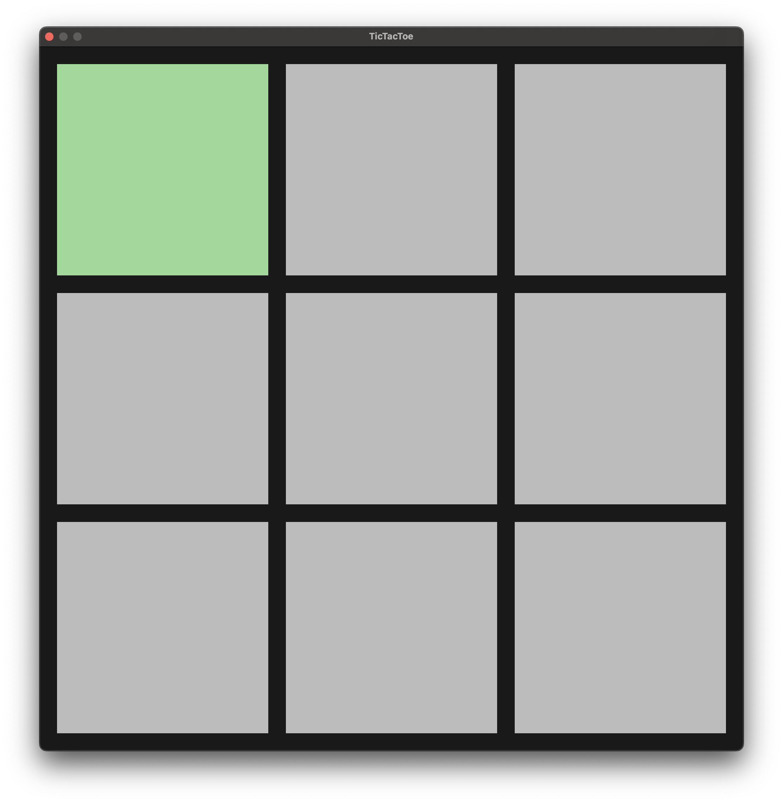
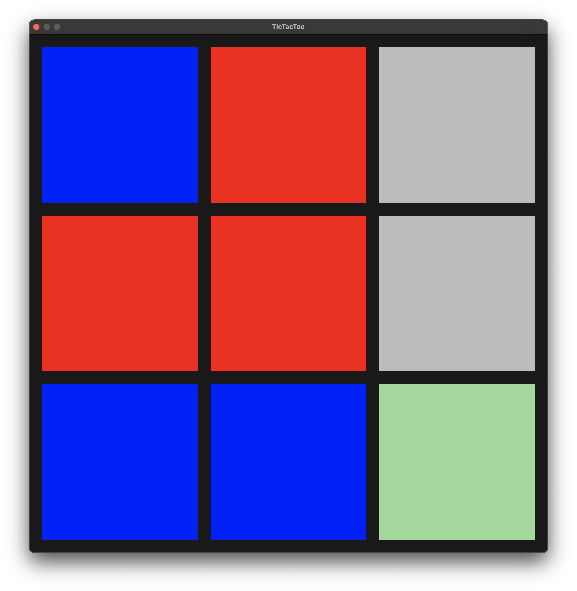
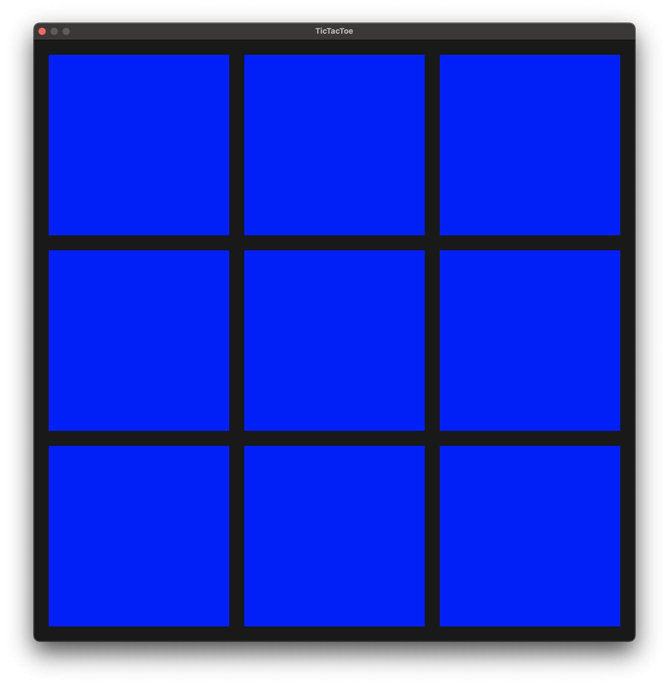
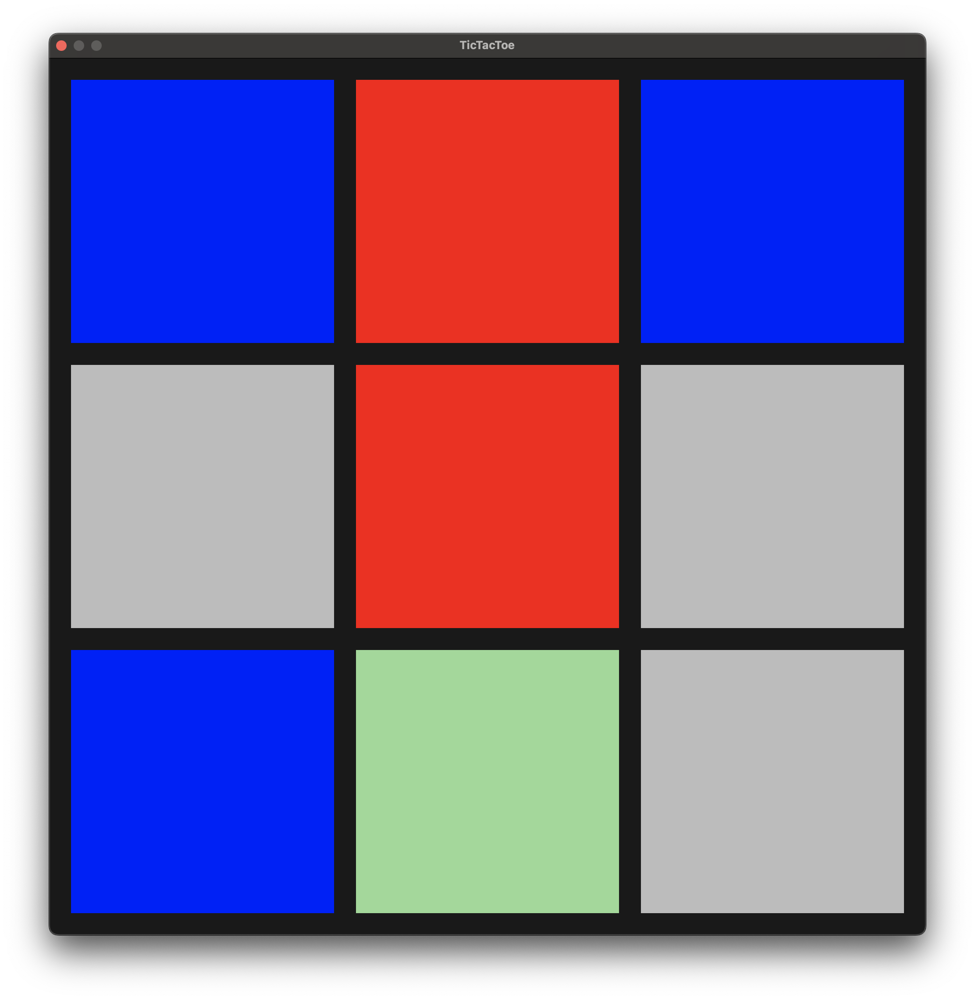
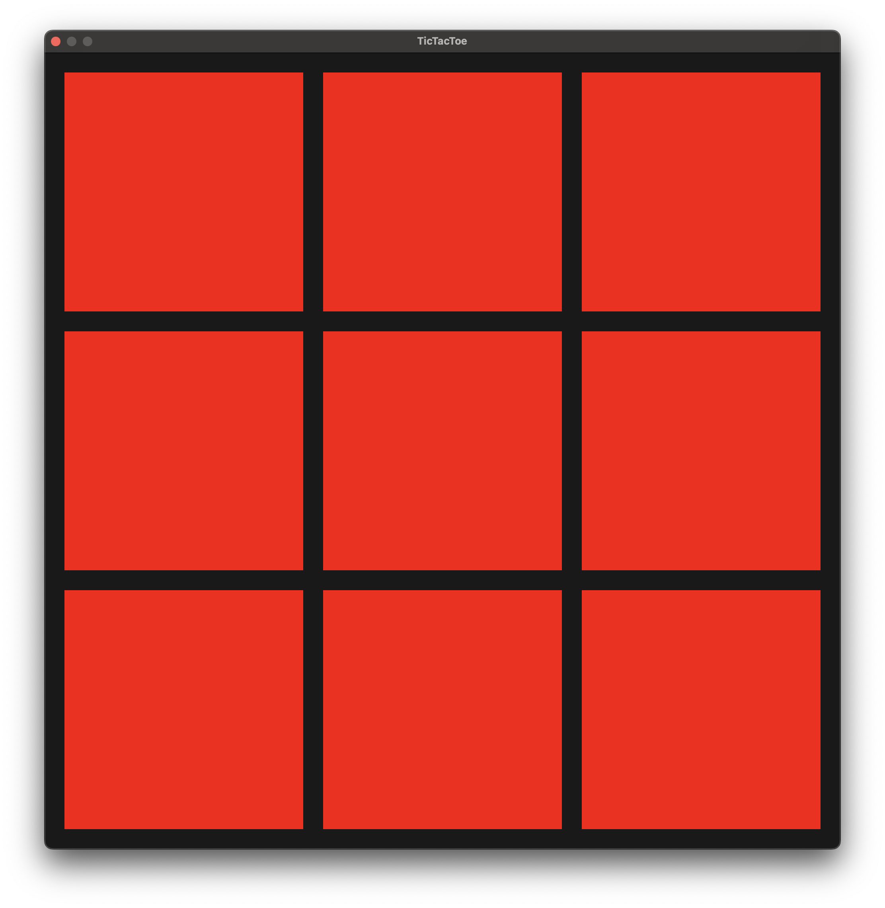

Building TicTacToe game with MetalCpp for macOS.


## Run the app

```zsh
# from project's root directory

$ chmod +x run.sh
$ ./run.sh
$ ./build/MetalApp
```

## Use the app

The app only supports keyboard and has no mouse or trackpad support.


To navigate the tiles:
- left: `a` or `h` or `left arrow`
- right: `d` or `l` or `right arrow`
- up: `w` or `k` or `up arrow`
- down: `s` or `j` or `down arrow`


## Game board pictures

|                                                                                          |                                                                                         |
|------------------------------------------------------------------------------------------|-----------------------------------------------------------------------------------------|
|                   |   |
|  |    |
|       |                                                                                         |
